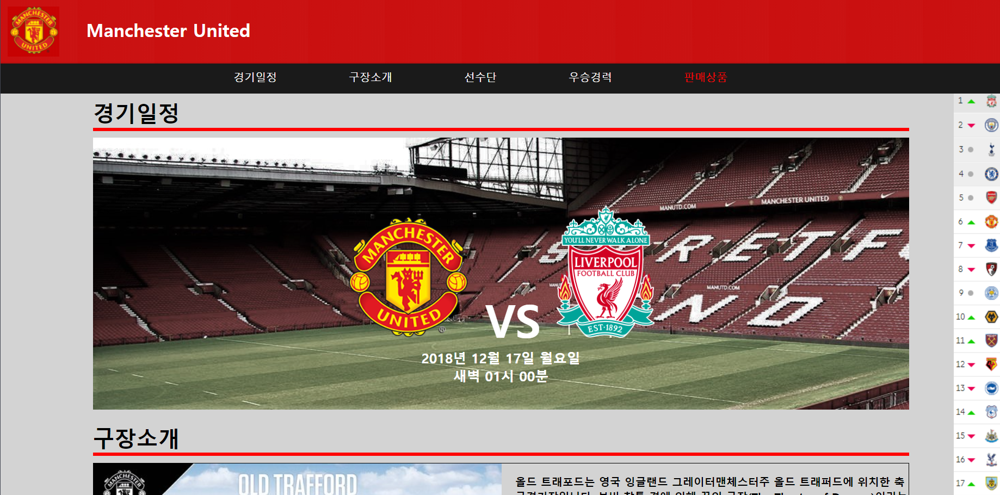
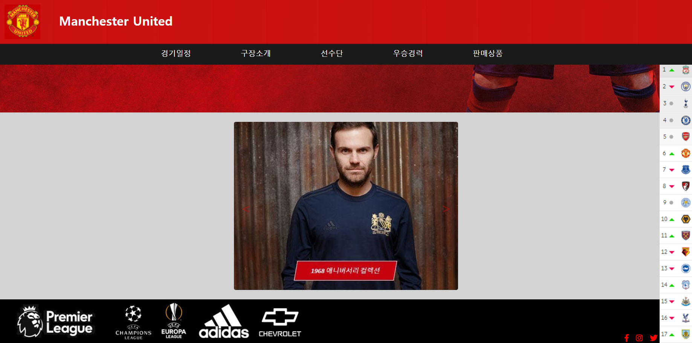

# CreativeCoding-Web_project
한림대학교 2018년도 1학기 창의코딩:웹 강의 기말고사 프로젝트

# 개요
&nbsp;html과 css, js를 이용하여 자기자신이 관심있는 분야에 관한 홈페이지 제작 및 구현

### 개발 환경
* Visual Studio Code
* HTML
* CSS
* JavaScript

# 주제
&nbsp;평소 해외축구에 관심이 많았었고, 특히 박지성 선수가 뛰었던 맨체스터 유나이티드 구단에 관심이 있었다. 그 구단을 설명하고 경기 일정, 순위, 등록 선수 등을 알려주는 홈페이지를 제작하게 되었다.

# 실행 요약

&nbsp;위 사진과 같이 html을 이용하여 페이지를 만들었다. 옆에 있는 slider bar는 스크롤을 움직일 때마다 항상 따라오게 된다. 하단의 footer 부분에는 아이콘을 추가하여 클릭을 하면 각 스폰서, 연맹 웹 사이트로 이동하도록 herf 링크를 걸어뒀다.
